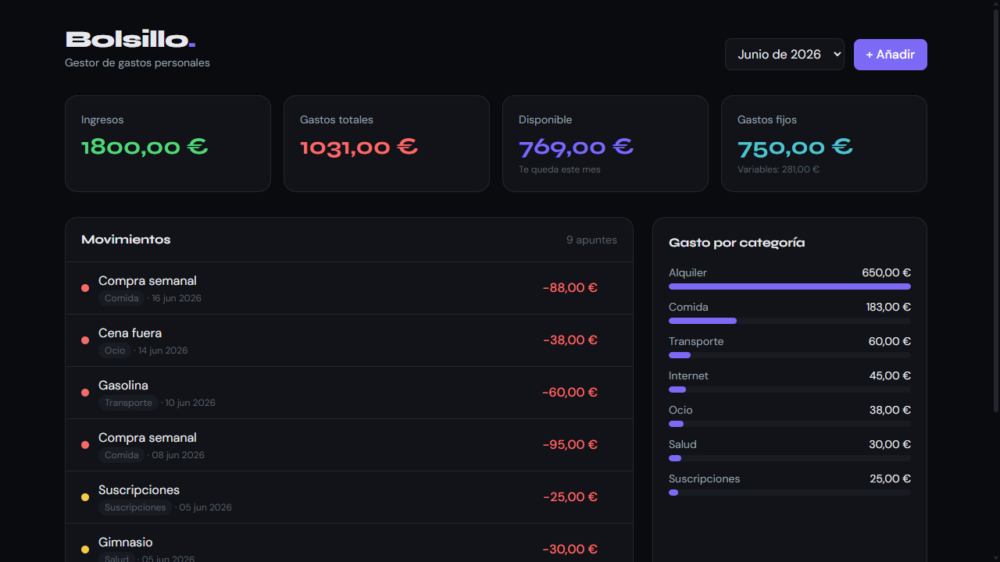

<h1 align="center">Bolsillo</h1>

<p align="center">
  <strong>Gestor de gastos personales de escritorio — offline, privado y rápido.</strong><br>
  App nativa para Windows hecha con Tauri 2 + Vue 3.
</p>

<p align="center">
  
  
  
  
  
</p>

<p align="center">
  
</p>

---

## Qué es

**Bolsillo** es una app de escritorio para llevar tus gastos e ingresos mes a mes, sin servidores ni cuentas: **todo se queda cifrado en tu equipo**. Rápida, cuidada y pensada para crecer.

> Los datos que trae al abrir son de **ejemplo** (genéricos). No contiene información personal de nadie.

## Características

- 📊 **Resumen del mes**: KPIs (ingresos, gastos totales, disponible, gastos fijos) y reparto de gasto por categoría.
- 🧾 **Movimientos**: ingresos y gastos **fijos** (recurrentes, se repiten cada mes) o **variables** (puntuales), con categoría y fecha.
- 💳 **Deudas**: tarjeta, préstamo, coche, moto, hipoteca… con **total**, **cuota mensual** y lo ya pagado. La cuota cuenta como gasto fijo y la deuda **se salda sola mes a mes** (barra de progreso y meses restantes). **Aviso del sistema al terminar de pagarla**.
- 📅 **Historial** de todos los meses con totales y ahorro acumulado.
- 📤 **Exportación a Excel (XLSX) y PDF** con el diálogo de guardar nativo.
- 🌗 **Tema claro y oscuro** a elegir en Ajustes.
- 🔒 **Bloqueo opcional** al abrir, por **PIN (4–6 dígitos)** o **contraseña**.
- 🔐 **Datos cifrados** en disco (AES-GCM): solo la app los lee.
- 💾 **Copia de seguridad**: exporta e importa todos tus datos en un archivo.
- 🏷️ **Categorías** amplias y agrupadas por color.

## Stack

| Capa | Tecnología |
|------|------------|
| **Núcleo desktop** | Tauri 2 (Rust) |
| **Interfaz** | Vue 3 + TypeScript (`<script setup>`) |
| **Estilos** | Tailwind CSS 4 |
| **Estado** | Pinia |
| **Build** | Vite |
| **Exportación** | ExcelJS (XLSX) · jsPDF (PDF) |
| **Seguridad** | Web Crypto (AES-GCM + PBKDF2) |

## Desarrollo

Requisitos: [Node.js](https://nodejs.org) + [pnpm](https://pnpm.io), [Rust](https://rustup.rs) y los [prerequisitos de Tauri](https://tauri.app/start/prerequisites/).

```bash
pnpm install        # instalar dependencias
pnpm tauri dev      # app de escritorio en modo desarrollo
pnpm dev            # solo el frontend en el navegador (http://localhost:1420)
pnpm tauri build    # generar el ejecutable y los instaladores
```

Los instaladores quedan en `src-tauri/target/release/bundle/` (NSIS `.exe` y MSI).

## Privacidad

Bolsillo funciona **100% offline**. No hay servidores, cuentas ni telemetría. Tus datos se guardan **cifrados** en tu equipo; si activas PIN o contraseña, la clave de cifrado se deriva de ella (si la olvidas, los datos no se pueden recuperar).

## Licencia

[MIT](LICENSE) — © Daniel Castaños Mefle
