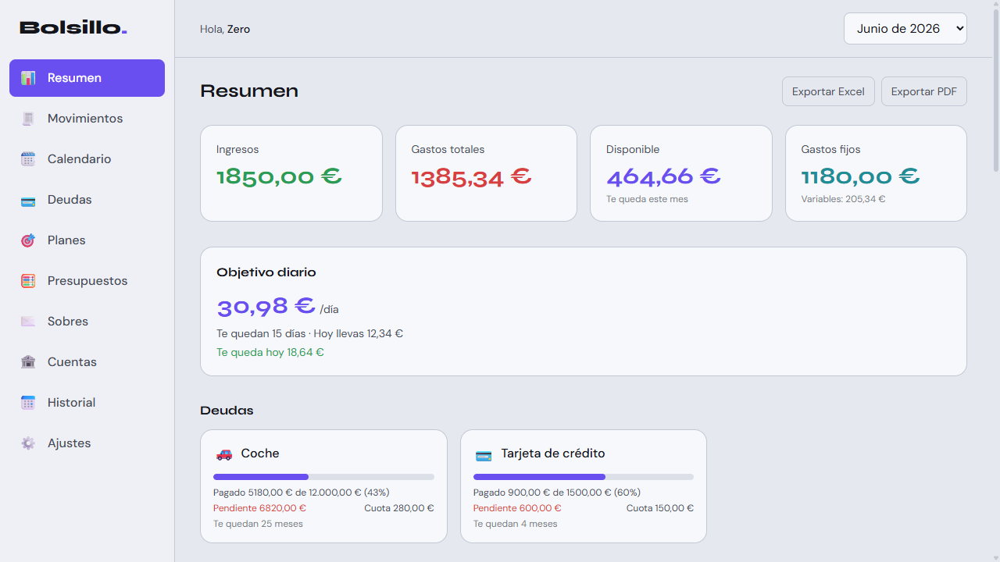

<h1 align="center">Bolsillo</h1>

<p align="center">
  <strong>Your money, on your machine. Private, offline, encrypted personal finance.</strong><br>
  <em>Tu dinero, en tu equipo. Finanzas personales privadas, offline y cifradas.</em>
</p>

<p align="center">
  
  
  
  
  
  
  
</p>

<p align="center">
  <a href="https://danimefle.com"><strong>danimefle.com</strong></a> — author's portfolio / portfolio del autor
</p>

<!-- screenshot -->
<p align="center">
  
</p>

---

## English

### What is Bolsillo?

**Bolsillo** is a desktop app for managing your personal finances month to month — income, expenses, debts, savings and budgets — with **zero servers and zero accounts**. Everything you enter is stored **encrypted on your own machine**. No cloud, no telemetry, nothing ever leaves your device.

It is built as a showcase / portfolio project, with production-grade attention to privacy, polish and code quality.

> The data shown on first launch is **generic sample data**. It contains no personal information about anyone.

### Features

- **Income & expenses** — recurring (fixed monthly) or one-off (variable), each with category, date, merchant and tags.
- **Split transactions** — distribute a single expense across several categories.
- **Debts** — credit card, loan, car, mortgage… with total, monthly installment and amount already paid. The installment counts as a fixed expense and the debt **clears itself month by month** (progress bar + remaining months).
- **Savings goals / plans** — set targets and track progress over time.
- **Category budgets** — set a spending limit per category and watch it as the month fills up.
- **Envelopes** — split the month's money into envelopes and assign each expense to one.
- **Accounts / wallets** — multiple accounts with a net-worth overview.
- **Expense calendar** — see your spending laid out day by day.
- **History & analytics** — yearly summary, period comparison, evolution chart and a ranking by merchant.
- **Receipts** — attach a receipt image to any transaction.
- **Quick-add templates** — save common entries as templates for one-tap logging.
- **Reminders & native notifications** — upcoming payments, debt paid off, monthly reminder.
- **Backups** — export / import all your data as a JSON file.
- **Export to Excel (XLSX) and PDF** through the native save dialog.
- **Light & dark theme.**
- **Multilingual (English / Spanish)** — switch on the fly; the system language is detected on first launch.

### Privacy & Security

Bolsillo is **100% offline**. There are no servers, no accounts, no telemetry — your data never leaves the device.

- **All financial data is encrypted on disk** using **AES-GCM 256** with keys derived via **PBKDF2** (Web Crypto API).
- **Optional app lock** with a **PIN (4–6 digits)** or a **password**. The encryption key is derived from it — if you forget it, the data cannot be recovered.
- **Even without a PIN/password the data is still obfuscated** at rest, so it is never stored in plain text.

### Tech stack

| Layer | Technology |
|-------|------------|
| **Desktop core** | Tauri 2 (Rust) |
| **UI** | Vue 3 + TypeScript (`<script setup>`) |
| **Styling** | Tailwind CSS 4 |
| **State** | Pinia |
| **Build** | Vite |
| **Export** | ExcelJS (XLSX) · jsPDF (PDF) |
| **Crypto** | Web Crypto (AES-GCM 256 + PBKDF2) |
| **Package manager** | pnpm |

### Getting started

**Requirements:** [Node.js](https://nodejs.org), [pnpm](https://pnpm.io), [Rust](https://rustup.rs) and the [Tauri prerequisites](https://tauri.app/start/prerequisites/) for your OS.

```bash
pnpm install        # install dependencies
pnpm tauri dev      # run the desktop app in development mode
pnpm dev            # frontend only, in the browser (http://localhost:1420)
pnpm tauri build    # build the executable and installers
```

Installers are generated under `src-tauri/target/release/bundle/`.

### Project structure

```
bolsillo/
├─ src/                 # Vue 3 frontend
│  ├─ views/            # main screens (dashboard, history, settings…)
│  ├─ components/       # reusable UI components
│  ├─ stores/           # Pinia stores (state & business logic)
│  ├─ utils/            # helpers: crypto, export, formatting…
│  └─ data/             # sample data & default categories
└─ src-tauri/           # Tauri 2 native shell (Rust)
```

### Roadmap

- Cloud-free sync between your own devices.
- More report formats and richer charts.
- Additional languages.

### License

[MIT](LICENSE) — © Daniel Castaños Mefle · [danimefle.com](https://danimefle.com)

---

## Español

### Qué es Bolsillo

**Bolsillo** es una app de escritorio para gestionar tus finanzas personales mes a mes — ingresos, gastos, deudas, ahorro y presupuestos — **sin servidores y sin cuentas**. Todo lo que introduces se guarda **cifrado en tu propio equipo**. Sin nube, sin telemetría, nada sale del dispositivo.

Está hecho como proyecto showcase / portfolio, con cuidado de nivel producción en privacidad, acabado y calidad de código.

> Los datos que se muestran al abrir por primera vez son **datos de ejemplo genéricos**. No contienen información personal de nadie.

### Características

- **Ingresos y gastos** — recurrentes (fijos cada mes) o puntuales (variables), cada uno con categoría, fecha, comercio y etiquetas.
- **Gasto dividido** — reparte un mismo gasto entre varias categorías.
- **Deudas** — tarjeta, préstamo, coche, hipoteca… con total, cuota mensual y lo ya pagado. La cuota cuenta como gasto fijo y la deuda **se salda sola mes a mes** (barra de progreso + meses restantes).
- **Planes / metas de ahorro** — fija objetivos y sigue su progreso en el tiempo.
- **Presupuestos por categoría** — pon un límite de gasto por categoría y míralo según avanza el mes.
- **Sobres** — reparte el dinero del mes en sobres y asigna cada gasto a uno.
- **Cuentas / monederos** — varias cuentas con vista de patrimonio.
- **Calendario de gastos** — ve tu gasto repartido día a día.
- **Historial y análisis** — resumen anual, comparativa de periodos, gráfica de evolución y ranking por comercio.
- **Recibos** — adjunta la imagen del recibo a cualquier movimiento.
- **Plantillas de alta rápida** — guarda movimientos habituales como plantillas para registrarlos de un toque.
- **Recordatorios y notificaciones nativas** — pagos próximos, deuda saldada, recordatorio mensual.
- **Copias de seguridad** — exporta e importa todos tus datos en un archivo JSON.
- **Exportación a Excel (XLSX) y PDF** con el diálogo de guardar nativo.
- **Tema claro y oscuro.**
- **Multilenguaje (español / inglés)** — conmutable en caliente; detecta el idioma del sistema en el primer arranque.

### Privacidad y seguridad

Bolsillo funciona **100% offline**. No hay servidores, ni cuentas, ni telemetría — tus datos nunca salen del dispositivo.

- **Todos los datos financieros se guardan cifrados en disco** con **AES-GCM 256** y claves derivadas con **PBKDF2** (Web Crypto API).
- **Bloqueo opcional de la app** con **PIN (4–6 dígitos)** o **contraseña**. La clave de cifrado se deriva de él — si lo olvidas, los datos no se pueden recuperar.
- **Aunque no pongas PIN/contraseña, los datos se ofuscan igualmente** en disco, así que nunca se guardan en texto plano.

### Stack técnico

| Capa | Tecnología |
|------|------------|
| **Núcleo desktop** | Tauri 2 (Rust) |
| **Interfaz** | Vue 3 + TypeScript (`<script setup>`) |
| **Estilos** | Tailwind CSS 4 |
| **Estado** | Pinia |
| **Build** | Vite |
| **Exportación** | ExcelJS (XLSX) · jsPDF (PDF) |
| **Cifrado** | Web Crypto (AES-GCM 256 + PBKDF2) |
| **Gestor de paquetes** | pnpm |

### Puesta en marcha

**Requisitos:** [Node.js](https://nodejs.org), [pnpm](https://pnpm.io), [Rust](https://rustup.rs) y los [prerequisitos de Tauri](https://tauri.app/start/prerequisites/) para tu sistema.

```bash
pnpm install        # instalar dependencias
pnpm tauri dev      # app de escritorio en modo desarrollo
pnpm dev            # solo el frontend, en el navegador (http://localhost:1420)
pnpm tauri build    # generar el ejecutable y los instaladores
```

Los instaladores quedan en `src-tauri/target/release/bundle/`.

### Estructura del proyecto

```
bolsillo/
├─ src/                 # frontend Vue 3
│  ├─ views/            # pantallas principales (panel, historial, ajustes…)
│  ├─ components/       # componentes de UI reutilizables
│  ├─ stores/           # stores de Pinia (estado y lógica de negocio)
│  ├─ utils/            # utilidades: cifrado, exportación, formato…
│  └─ data/             # datos de ejemplo y categorías por defecto
└─ src-tauri/           # capa nativa de Tauri 2 (Rust)
```

### Roadmap

- Sincronización entre tus propios dispositivos, sin nube.
- Más formatos de informe y gráficas más completas.
- Más idiomas.

### Licencia

[MIT](LICENSE) — © Daniel Castaños Mefle · [danimefle.com](https://danimefle.com)
