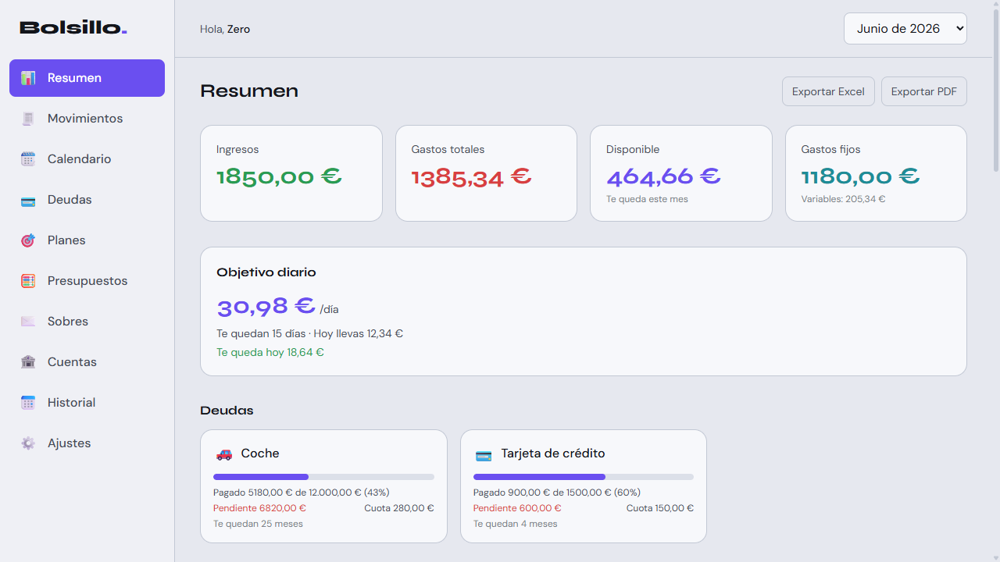

<h1 align="center">Bolsillo</h1>

<p align="center">
  <strong>Tu dinero, en tu equipo. Finanzas personales privadas, offline y cifradas.</strong><br>
  <em>Your money, on your machine. Private, offline, encrypted personal finance.</em>
</p>

<p align="center">
  <a href="#es"><strong>ES</strong></a> | <a href="#en"><strong>EN</strong></a>
</p>

<p align="center">
  <a href="https://github.com/zeroit789/bolsillo/actions/workflows/ci.yml"></a>
  
  
  
  
  
</p>

<p align="center">
  
</p>

---

<a id="es"></a>

## Español

### Qué es

Bolsillo es una app de escritorio (Windows, macOS y Linux, vía Tauri) para llevar las finanzas personales mes a mes: ingresos, gastos, deudas, ahorro y presupuestos. No usa servidores ni cuentas. Todo se guarda cifrado en tu equipo y no sale de él.

Es un proyecto de portfolio de código abierto, versión **1.1.0**.

> Al abrirla por primera vez carga **datos de ejemplo inventados** (una nómina, un alquiler, un coche a plazos…). No son datos de ninguna persona real y los puedes borrar o sustituir por los tuyos.

### Funcionalidades

- **Movimientos**: gastos e ingresos fijos (se repiten cada mes, con día de pago opcional) o puntuales. Cada uno con categoría, fecha, comercio, etiquetas, cuenta y foto del recibo. Buscador y filtro por tipo.
- **Gasto dividido**: un mismo gasto repartido entre varias categorías.
- **Plantillas de alta rápida**: movimientos habituales que se registran con un clic.
- **Deudas**: tarjeta, préstamo, coche, hipoteca… con total, cuota mensual, lo ya pagado y día de cobro. La cuota cuenta como gasto fijo y la deuda se va saldando sola mes a mes (barra de progreso y meses restantes).
- **Planes de ahorro**: metas con objetivo y aportaciones.
- **Presupuestos por categoría** y **sobres** para repartir el dinero del mes.
- **Cuentas y patrimonio**: varias cuentas o monederos con saldo inicial y patrimonio total.
- **Resumen del mes**: tarjetas de ingresos, gastos, disponible y gastos fijos; objetivo de gasto diario; gasto por categoría (gráfica de dona); evolución ingresos/gastos; previsión de caja a 6 meses.
- **Calendario** con mapa de calor del gasto diario.
- **Historial**: tabla mes a mes, resumen anual, comparativa con el mes anterior y ranking de comercios («dónde gastas»).
- **Exportación**: el mes a Excel (XLSX) y PDF; el historial a XLSX, PDF y CSV. Se guarda con el diálogo nativo de «Guardar como».
- **Copia de seguridad**: exportar e importar todos los datos en un archivo JSON.
- **Notificaciones nativas**: deuda saldada, pagos próximos y recordatorio mensual.
- **Ajustes**: tema claro u oscuro, moneda (EUR, USD, GBP, MXN, ARS, COP, CLP, BRL), idioma y categorías propias.
- **Español e inglés**, con cambio en caliente. En el primer arranque detecta el idioma del sistema.
- **Atajos de teclado** en Movimientos: `N` abre el alta de un movimiento y `Esc` cierra el formulario.

### Privacidad y seguridad

- Los datos financieros se guardan en el `localStorage` del WebView de Tauri, **cifrados con AES-GCM 256**. La clave se deriva con **PBKDF2-SHA256 (150 000 iteraciones)** usando la Web Crypto API.
- **Bloqueo opcional** con PIN (4 a 6 dígitos) o contraseña (mínimo 4 caracteres). La clave de cifrado sale de esa credencial: si la olvidas, los datos no se pueden recuperar.
- **Sin PIN ni contraseña** los datos solo se **ofuscan**: se cifran con una clave fija que está en el código, así que no se guardan en texto plano pero tampoco quedan protegidos frente a alguien con acceso a tu equipo. Si te importa la privacidad, activa el bloqueo.
- Los ajustes (tema, idioma, nombre, moneda) se guardan sin cifrar porque no son sensibles.
- **La copia de seguridad JSON se exporta sin cifrar.** Guárdala en un sitio seguro.
- No hay telemetría ni llamadas a servidores propios. La única petición externa es la carga de las fuentes tipográficas desde Google Fonts.

### Stack

Versiones exactas de `pnpm-lock.yaml` y `src-tauri/Cargo.lock`:

| Pieza | Paquete | Versión |
|---|---|---|
| Núcleo de escritorio | `tauri` (Rust) · `@tauri-apps/cli` | 2.11.2 · 2.11.2 |
| API de Tauri para el frontend | `@tauri-apps/api` | 2.11.0 |
| Plugins de Tauri | `plugin-dialog` · `plugin-notification` · `plugin-opener` · `plugin-fs` | 2.7.1 · 2.3.3 · 2.5.4 · 2.5.1 |
| Interfaz | `vue` | 3.5.38 |
| Estado | `pinia` | 3.0.4 |
| Estilos | `tailwindcss` · `@tailwindcss/vite` | 4.3.1 · 4.3.1 |
| Build | `vite` · `@vitejs/plugin-vue` | 6.4.3 · 5.2.4 |
| Tipos | `typescript` · `vue-tsc` | 5.6.3 · 2.2.12 |
| Exportación | `exceljs` · `jspdf` · `jspdf-autotable` | 4.4.0 · 4.2.1 · 5.0.8 |
| Serialización (Rust) | `serde` · `serde_json` | 1.0.228 · 1.0.150 |

### Requisitos

- [Node.js](https://nodejs.org) 24 y [pnpm](https://pnpm.io) 12 (las versiones que usa la CI).
- [Rust](https://rustup.rs) estable y los [requisitos previos de Tauri](https://tauri.app/start/prerequisites/) de tu sistema. Solo hacen falta para la app de escritorio; el frontend en el navegador funciona sin Rust.

### Instalación y comandos

```bash
pnpm install        # instala las dependencias
pnpm tauri dev      # app de escritorio en modo desarrollo
pnpm dev            # solo el frontend, en el navegador (http://localhost:1420)
pnpm build          # comprueba tipos (vue-tsc) y genera el frontend en dist/
pnpm preview        # sirve el build de dist/ para revisarlo
pnpm tauri build    # ejecutable e instaladores en src-tauri/target/release/bundle/
```

En el navegador (`pnpm dev`) la interfaz funciona, pero lo que depende de Tauri (diálogo de guardar al exportar y notificaciones nativas) solo va dentro de la app de escritorio.

### Tests y CI

- **Tests**: todavía no hay tests automatizados.
- **Lint**: no hay ESLint ni Prettier configurados. La comprobación de calidad actual es el tipado estricto de TypeScript con `vue-tsc`.
- **CI** ([`.github/workflows/ci.yml`](.github/workflows/ci.yml)), en cada push y pull request a `main`:
  1. **Secretos**: `gitleaks` 8.30.1 (binario verificado por SHA256) sobre todo el historial.
  2. **Frontend**: `pnpm install --frozen-lockfile`, `vue-tsc --noEmit` y `vite build` con Node 24 y pnpm 12.

  La app de escritorio (Rust) no se compila en la CI.

Para repetir la CI en local: `pnpm install --frozen-lockfile && pnpm build`.

### Estructura

```
bolsillo/
├─ .github/workflows/ci.yml   # CI: gitleaks + vue-tsc + build de Vite
├─ docs/screenshot.png        # captura del README (datos de ejemplo)
├─ art/                       # material gráfico
├─ public/                    # recursos estáticos
├─ index.html                 # página que monta la app
├─ src/                       # frontend (Vue 3 + TypeScript)
│  ├─ App.vue                 # navegación, bloqueo, onboarding y notificaciones
│  ├─ main.ts                 # arranque de Vue y Pinia
│  ├─ i18n.ts                 # traducciones reactivas ES/EN
│  ├─ assets/main.css         # tema de Tailwind (oscuro y claro)
│  ├─ views/                  # 10 pantallas: resumen, movimientos, calendario, deudas,
│  │                          #   planes, presupuestos, sobres, cuentas, historial, ajustes
│  ├─ components/             # gráficas, modal de movimiento, onboarding, bloqueo…
│  ├─ stores/                 # Pinia: finanzas, ajustes y sesión (bloqueo y guardado)
│  ├─ utils/                  # cifrado, almacenamiento, exportación, formato, deudas, avisos
│  ├─ data/                   # categorías por defecto y datos de ejemplo
│  └─ types/                  # tipos del dominio y validación de copias
└─ src-tauri/                 # capa nativa (Rust)
   ├─ src/lib.rs              # plugins y comando para escribir exportaciones a disco
   ├─ src/main.rs             # punto de entrada
   ├─ capabilities/           # permisos de la ventana
   └─ tauri.conf.json         # ventana, build e instaladores
```

El código lleva comentarios en español y en inglés.

### Licencia

[MIT](LICENSE) © 2026 Daniel Castaños Mefle · [danimefle.com](https://danimefle.com)

---

<a id="en"></a>

## English

### What it is

Bolsillo is a desktop app (Windows, macOS and Linux, built with Tauri) for tracking your personal finances month by month: income, expenses, debts, savings and budgets. There are no servers and no accounts. Everything is stored encrypted on your computer and never leaves it.

It's an open-source portfolio project, version **1.1.0**.

> On first launch it loads **made-up sample data** (a paycheck, rent, a car loan…). None of it belongs to a real person, and you can delete it or replace it with your own.

### Features

- **Transactions**: recurring expenses and income (repeat every month, with an optional payment day) or one-off ones. Each has a category, date, merchant, tags, account and a receipt photo. Search box and type filter.
- **Split expenses**: spread a single expense across several categories.
- **Quick-add templates**: log your usual transactions with one click.
- **Debts**: credit card, loan, car, mortgage… with total, monthly payment, amount already paid and charge day. The payment counts as a recurring expense and the debt pays itself down month by month (progress bar and months left).
- **Savings plans**: goals with a target and contributions.
- **Category budgets** and **envelopes** to split up the month's money.
- **Accounts and net worth**: multiple accounts or wallets with a starting balance and a total net worth.
- **Monthly summary**: income, expenses, available and recurring-expense cards; a daily spending target; spending by category (donut chart); income vs. expense trend; 6-month cash flow forecast.
- **Calendar** with a heat map of daily spending.
- **History**: month-by-month table, yearly summary, comparison with last month and a merchant ranking ("where your money goes").
- **Export**: the month to Excel (XLSX) and PDF; the history to XLSX, PDF and CSV, through the native "Save as" dialog.
- **Backup**: export and import all your data as a JSON file.
- **Native notifications**: debt paid off, upcoming payments and a monthly reminder.
- **Settings**: light or dark theme, currency (EUR, USD, GBP, MXN, ARS, COP, CLP, BRL), language and custom categories.
- **Spanish and English**, switchable on the fly. The system language is detected on first launch.
- **Keyboard shortcuts** in Transactions: `N` opens the new-transaction form and `Esc` closes it.

### Privacy and security

- Financial data is stored in the Tauri WebView's `localStorage`, **encrypted with AES-GCM 256**. The key is derived with **PBKDF2-SHA256 (150,000 iterations)** using the Web Crypto API.
- **Optional lock** with a PIN (4 to 6 digits) or a password (at least 4 characters). The encryption key comes from that credential, so if you forget it your data can't be recovered.
- **Without a PIN or password** the data is only **obfuscated**: it's encrypted with a fixed key that lives in the source code. It isn't stored as plain text, but it isn't protected from someone with access to your computer either. If privacy matters to you, turn on the lock.
- Settings (theme, language, name, currency) are stored unencrypted because they aren't sensitive.
- **The JSON backup is exported unencrypted.** Keep it somewhere safe.
- There's no telemetry and no calls to any backend. The only outside request is loading the fonts from Google Fonts.

### Stack

Exact versions from `pnpm-lock.yaml` and `src-tauri/Cargo.lock`:

| Part | Package | Version |
|---|---|---|
| Desktop core | `tauri` (Rust) · `@tauri-apps/cli` | 2.11.2 · 2.11.2 |
| Tauri API for the frontend | `@tauri-apps/api` | 2.11.0 |
| Tauri plugins | `plugin-dialog` · `plugin-notification` · `plugin-opener` · `plugin-fs` | 2.7.1 · 2.3.3 · 2.5.4 · 2.5.1 |
| UI | `vue` | 3.5.38 |
| State | `pinia` | 3.0.4 |
| Styling | `tailwindcss` · `@tailwindcss/vite` | 4.3.1 · 4.3.1 |
| Build | `vite` · `@vitejs/plugin-vue` | 6.4.3 · 5.2.4 |
| Types | `typescript` · `vue-tsc` | 5.6.3 · 2.2.12 |
| Export | `exceljs` · `jspdf` · `jspdf-autotable` | 4.4.0 · 4.2.1 · 5.0.8 |
| Serialization (Rust) | `serde` · `serde_json` | 1.0.228 · 1.0.150 |

### Requirements

- [Node.js](https://nodejs.org) 24 and [pnpm](https://pnpm.io) 12 (the versions CI uses).
- Stable [Rust](https://rustup.rs) and the [Tauri prerequisites](https://tauri.app/start/prerequisites/) for your OS. You only need them for the desktop app; the frontend runs in the browser without Rust.

### Install and commands

```bash
pnpm install        # install dependencies
pnpm tauri dev      # desktop app in development mode
pnpm dev            # frontend only, in the browser (http://localhost:1420)
pnpm build          # type-check (vue-tsc) and build the frontend into dist/
pnpm preview        # serve the dist/ build to check it
pnpm tauri build    # executable and installers in src-tauri/target/release/bundle/
```

In the browser (`pnpm dev`) the UI works, but anything that relies on Tauri (the save dialog when exporting and native notifications) only works inside the desktop app.

### Tests and CI

- **Tests**: there are no automated tests yet.
- **Linting**: ESLint and Prettier aren't set up. The current quality gate is strict TypeScript checking with `vue-tsc`.
- **CI** ([`.github/workflows/ci.yml`](.github/workflows/ci.yml)) runs on every push and pull request to `main`:
  1. **Secrets**: `gitleaks` 8.30.1 (binary verified by SHA256) over the full history.
  2. **Frontend**: `pnpm install --frozen-lockfile`, `vue-tsc --noEmit` and `vite build` on Node 24 and pnpm 12.

  The desktop app (Rust) isn't compiled in CI.

To reproduce CI locally: `pnpm install --frozen-lockfile && pnpm build`.

### Project structure

```
bolsillo/
├─ .github/workflows/ci.yml   # CI: gitleaks + vue-tsc + Vite build
├─ docs/screenshot.png        # README screenshot (sample data)
├─ art/                       # artwork
├─ public/                    # static assets
├─ index.html                 # page that mounts the app
├─ src/                       # frontend (Vue 3 + TypeScript)
│  ├─ App.vue                 # navigation, lock screen, onboarding and notifications
│  ├─ main.ts                 # Vue and Pinia bootstrap
│  ├─ i18n.ts                 # reactive ES/EN translations
│  ├─ assets/main.css         # Tailwind theme (dark and light)
│  ├─ views/                  # 10 screens: summary, transactions, calendar, debts,
│  │                          #   plans, budgets, envelopes, accounts, history, settings
│  ├─ components/             # charts, transaction modal, onboarding, lock screen…
│  ├─ stores/                 # Pinia: finances, settings and session (lock and saving)
│  ├─ utils/                  # encryption, storage, export, formatting, debts, notifications
│  ├─ data/                   # default categories and sample data
│  └─ types/                  # domain types and backup validation
└─ src-tauri/                 # native layer (Rust)
   ├─ src/lib.rs              # plugins and the command that writes exports to disk
   ├─ src/main.rs             # entry point
   ├─ capabilities/           # window permissions
   └─ tauri.conf.json         # window, build and installers
```

Code comments are written in both Spanish and English.

### License

[MIT](LICENSE) © 2026 Daniel Castaños Mefle · [danimefle.com](https://danimefle.com)
